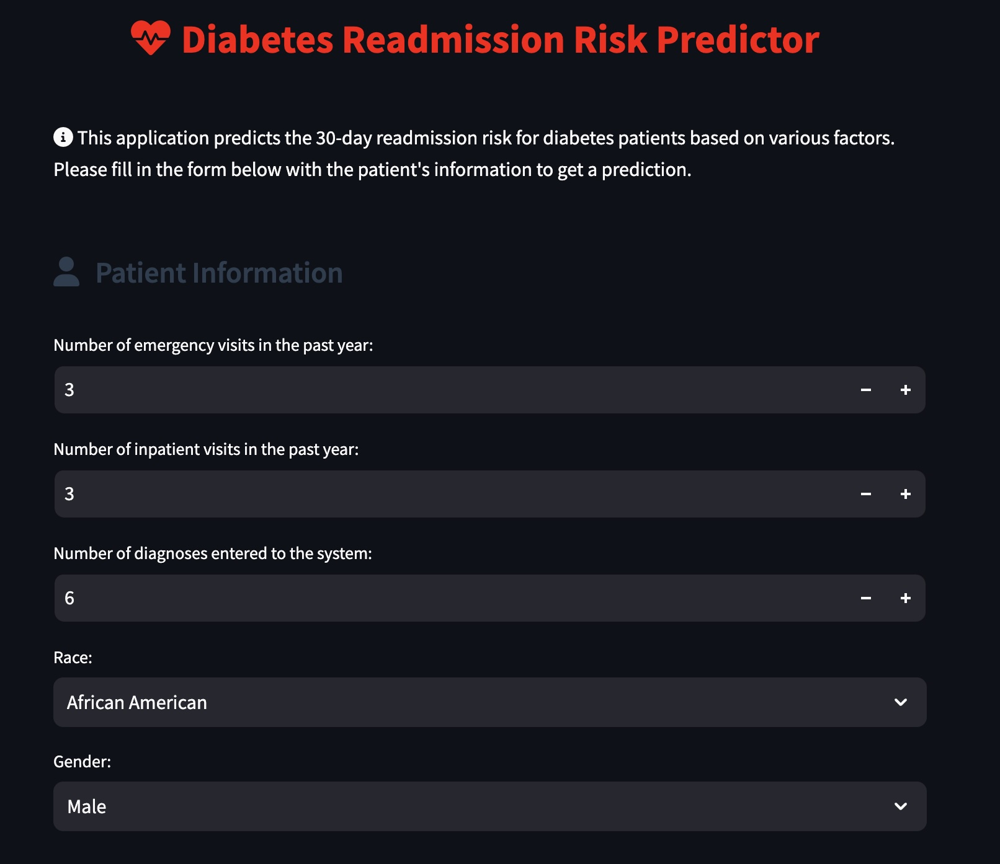

# 🏥 Diabetes Readmission Risk Predictor

[](https://diabetes-pred.streamlit.app/)

## ⚠️ Educational Purpose Disclaimer
This project was developed for educational purposes only. It should not be used for making real medical decisions. Always consult with qualified healthcare professionals for medical advice.

## 🔍 Overview
The Diabetes Readmission Risk Predictor is a web-based application that helps healthcare professionals assess the 30-day hospital readmission risk for diabetes patients. Using machine learning, it analyzes various patient factors and medication histories to predict the likelihood of readmission.



## ✨ Features
- **Patient Information Analysis**: Processes key patient metrics including:
  - Number of emergency visits
  - Number of inpatient visits
  - Total diagnoses count
  - Demographic information (race, gender)

- **💊 Comprehensive Medication Tracking**: Monitors changes and statuses for 20 different diabetes medications including:
  - Metformin
  - Insulin
  - Various combination medications
  - Other common diabetes medications

- **🎯 Real-time Risk Assessment**: Provides immediate readmission risk predictions with probability scores

- **🎨 User-Friendly Interface**: Features an intuitive design with:
  - Clear input sections
  - Visual indicators
  - Responsive layout
  - Informative icons and color-coding

## 🛠️ Technology Stack
- **Frontend**: Streamlit
- **Machine Learning**: Scikit-learn (Pickle model)
- **Data Processing**: Pandas
- **Styling**: Custom CSS with Font Awesome icons

## 💻 Local Development Setup
1. Clone the repository:
```bash
git clone https://github.com/ifyjakande/diabetes-readmission-predictor.git
cd diabetes-readmission-predictor
```

2. Create and activate a virtual environment:
```bash
python -m venv venv
source venv/bin/activate  # On Windows: venv\Scripts\activate
```

3. Install required packages:
```bash
pip install -r requirements.txt
```

4. Run the application:
```bash
streamlit run app.py
```

## 🤖 Model Information
The application uses a machine learning model trained on historical diabetes patient data. The model considers multiple factors to predict readmission risk, including:
- Patient demographics
- Visit history
- Medication changes
- Current prescriptions

## 📚 Dataset
This project uses the Diabetes 130-US hospitals for years 1999-2008 dataset from the UCI Machine Learning Repository. You can find the dataset here:
[UCI ML Repository - Diabetes Dataset](https://archive.ics.uci.edu/dataset/296/diabetes+130-us+hospitals+for+years+1999-2008)

## 📋 Requirements
- Python 3.8+
- Streamlit
- Pandas
- Scikit-learn
- Pickle

## 🚀 Deployment
The application is deployed on Streamlit Cloud and can be accessed at [https://diabetes-pred.streamlit.app/](https://diabetes-pred.streamlit.app/)

To deploy your own instance:
1. Fork this repository
2. Connect your GitHub account to Streamlit Cloud
3. Deploy the application through Streamlit Cloud's interface

---
Made with ❤️ for improving diabetes patient care and education 🎓
